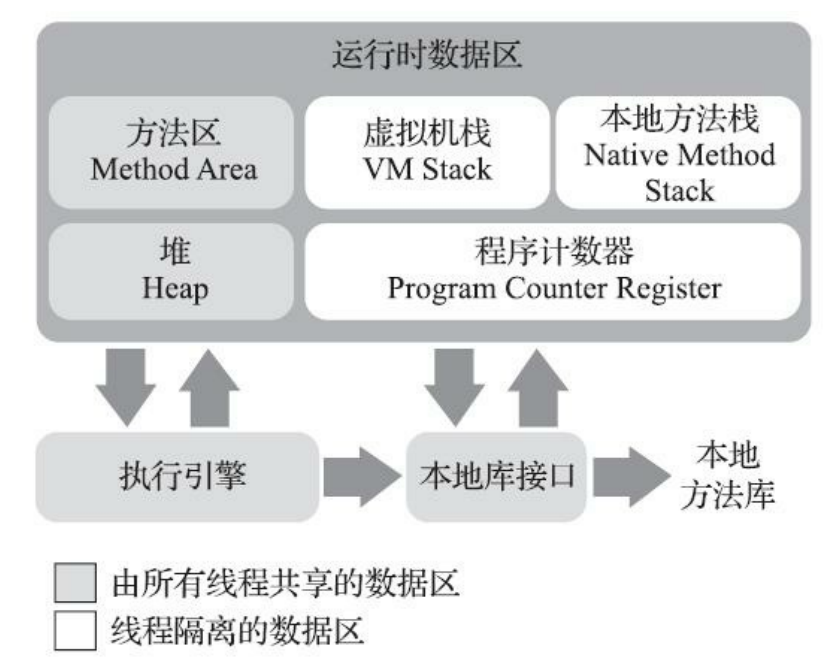
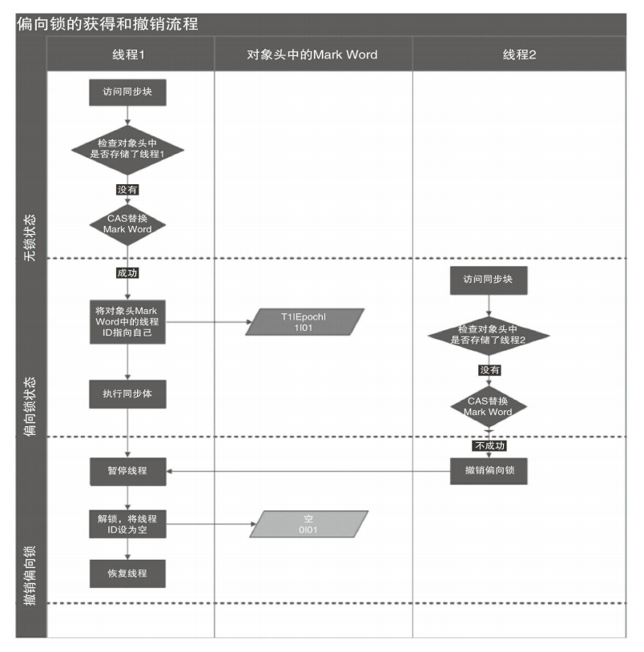
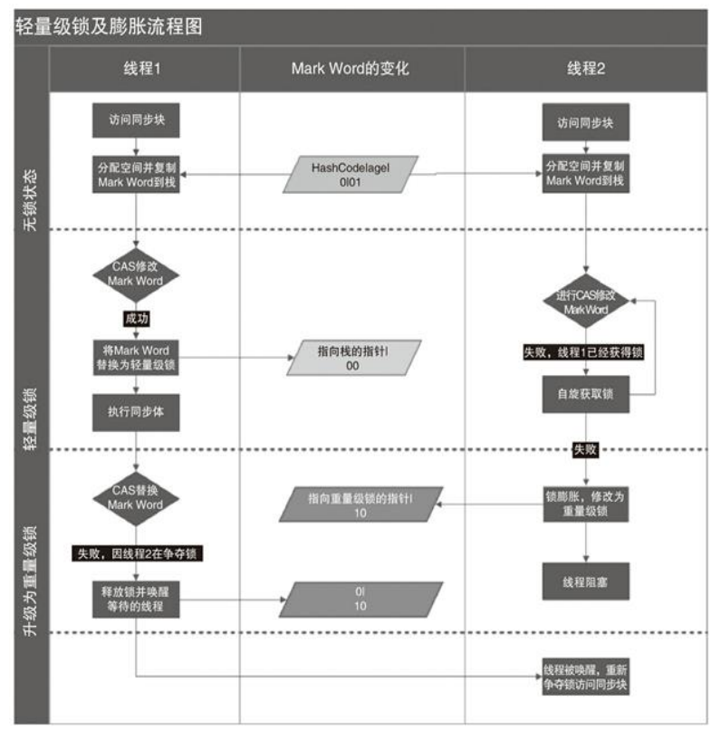

## synchronized 的实现原理

对 Synchronized 而言，其本身的锁与 Java 语言层面的 AQS，CAS 锁存在一定的差异，Synchronized 的锁机制是由 JVM 实现的，JVM 通过 **Monitor** 对象来实现对于方法以及代码块的同步，所以要研究 Synchronized 的底层实现原理，就需要去研究一下虚拟机内部是如何实现这套锁机制的，这里我们就是用 JDK 官方默认的一套 JVM 实现 HotSpot 作为其研究的对象，当然 JVM 的实现不只是只有这一种（比如有 **OpenJ9**、**GraalVM**），这里使用这一种只是因为 HotSpot 是官方默认并且使用率最高的一套实现。

在研究 HotSpot 关于 syncharonized 的具体实现之前，这里需要抛出一个疑问，有没有好奇，既然对于任何的锁来说，都是需要获取到锁资源，比如对于 AQS 与 CAS 我们有lock锁对象，通过 .lock 与 .unlock 就可完成对锁资源的获取与释放。那对于 synchronized 这种特殊的未声明任何的锁对象语法格式，其锁对象是在哪里呢？对于 synchronized  而言其锁对象是本身是一个监视器对象，也就是上面提到过的 **Monitor** 对象当然也有其将它称为 **Monitor（管程）** 。有意思的我们好像并能显式地看到这个对象，其实这就是接下来要引入的概念- **对象头** 。

### 对象头是从何而言，到何而去？

我们知道，对于一个对象创建之后无论你是使用何种方法，比如 new 、序列化、反射。这些创建的对象都是最终在绝大都数情况下都是被存储在了 JVM 内存空间当中的堆空间中，当然这个不包含已经发生内存逃逸的对象。

虽然堆已经是 JVM 内部的一块内存空间，但是为了更好的管理同意，堆的空间内存存储空间又被划分成了 对象头(Header)、实例数据(InstanceData)和对其填充(Padding),这三部分。

而这第一部分就是本篇关于 syncharonized 的重点，也就是存储 Montior 监视器对象的位置-对象头。这部分存储了对象在运行过程当中的自身运行是数据、比如哈希码、CG分代年龄、锁状态标志、线程持有的锁、偏向锁ID、偏向时间戳等。其头的大小是和虚拟机的架构位(这个架构位数大多数是源于 CPU 的寻址能力，就是一次可以处理数据的最大宽度)数有关，比如 32位与64位分别对应的就是 32 比特和 64比特，当然官方对于对象头有用另一种常用的叫法，就做 **Mark Word** 。

关于 **Mark Word ** 头信息当中存储的数据标志位可以参考下面这张表 																							

 

 

### 锁的升级以及对比

在 1.6 版本之前是没有锁升级这种概念的，在次之前一直都是以重量级锁作为 syncharoniozed 的锁机制的，后面是为了性能的优化和提升才引入了“偏向锁”以及“轻量锁” 这种概念和机制。随后锁便有了四种状态 **无锁状态、偏向锁状态、轻量级锁、重量级锁**，在这个过程当中锁除了偏向锁可以降级到无锁状态，其他的只能只升不降，其本身是为了提高获取锁和释放锁的效率。而触发降级的条件是当偏向锁的持有线程不再活跃（如线程终止），或发生竞争时，JVM 会撤销偏向锁，退回到 **无锁状态**。

| 二进制值（低3位） | 锁状态           | 升级方向                                       | 是否支持降级                   |
| ----------------- | :--------------- | :--------------------------------------------- | :----------------------------- |
| `001`             | **无锁**         | → 偏向锁 / 轻量级锁                            | -                              |
| `101`             | 锁状态**偏向锁** | 描述→ 轻量级锁                                 | **可以降级到无锁**（撤销偏向） |
| `000`             | **轻量级锁**     | 对象未被锁定，存储哈希码或分代年龄。→ 重量级锁 | **极少降级**（依赖 JVM 优化）  |
| `010`             | **重量级锁**     | 无进一步升级                                   | **不支持降级**                 |

 

 

从上面的 HotSpot 下 `biasedLocking.cpp` 文件当中 revoke_bias 方法下就可以看到具体的锁降级流程。

> 下面的运行案例可参考 UpgradeTest 测试类下的 upgrade 测试方法

~~~ bash
java.lang.Object object internals:
 OFFSET  SIZE   TYPE DESCRIPTION                               VALUE
      0     4        (object header)                           05 00 00 00 (00000101 00000000 00000000 00000000) (5)
      4     4        (object header)                           00 00 00 00 (00000000 00000000 00000000 00000000) (0)
      8     4        (object header)                           e5 01 00 f8 (11100101 00000001 00000000 11111000) (-134217243)
     12     4        (loss due to the next object alignment)
Instance size: 16 bytes
Space losses: 0 bytes internal + 4 bytes external = 4 bytes total

main:java.lang.Object object internals:
 OFFSET  SIZE   TYPE DESCRIPTION                               VALUE
      0     4        (object header)                           05 20 2f 92 (00000101 00100000 00101111 10010010) (-1842405371)
      4     4        (object header)                           c1 01 00 00 (11000001 00000001 00000000 00000000) (449)
      8     4        (object header)                           e5 01 00 f8 (11100101 00000001 00000000 11111000) (-134217243)
     12     4        (loss due to the next object alignment)
Instance size: 16 bytes
Space losses: 0 bytes internal + 4 bytes external = 4 bytes total

t1:java.lang.Object object internals:
 OFFSET  SIZE   TYPE DESCRIPTION                               VALUE
      0     4        (object header)                           7a 98 0d b6 (01111010 10011000 00001101 10110110) (-1240622982)
      4     4        (object header)                           c1 01 00 00 (11000001 00000001 00000000 00000000) (449)
      8     4        (object header)                           e5 01 00 f8 (11100101 00000001 00000000 11111000) (-134217243)
     12     4        (loss due to the next object alignment)
Instance size: 16 bytes
Space losses: 0 bytes internal + 4 bytes external = 4 bytes total
~~~

### 引言回顾

在前面的篇当中，简单的从为了解决悲观、乐观锁一路溜到了CPU层面的 LOCK 标记位，那么这篇就应该开始了解了解 Java 并发锁机制当中的头牌老大哥 synchronized 了，在开始本篇之前，我觉得还是需要回顾温习一下前面两篇章的核心内容和思路，在此基础之上引出今天要谈论的点。

首先开篇笔者是以 ***人有悲欢离合、月有阴晴圆缺*** 的乐观悲观锁为开篇的，从最终的数据源 SQL 为切入点，梳理了一下 SQL 当中为了解决并发而提供的一套悲观锁(排它锁)以及从设计层面实现的一个根据版本比较锁(乐观锁)，在此基础之上又讨论了一下 Java 当中的关键字 volatile ，在此基础之上研究了一下在并发编程当中，对于不同的线程之间独有的工作空间而导致的数据不一致问题，从源代码到汇编指令层面研究了 volatile 关键字所具有的特性，并讲清楚了 x86 CPU 指令集当中的 LOCK 指令，是如何在发出 LOCK# 的信号前提下将缓存行数据锁定，在保证其他 CPU 不能修改和读取数据的前提下进行独占修改，从而在修改完成之后，其他 CPU 在进行变量副本比对是否有命中缓存行从而失效，实现不同线程内部的数据同步更新。当然也提到过关于 Doug Lea 在 LinkedTransferQueue 当中关于 volatile 修饰的变量通过追加64位字节进行了缓存行的优化。

虽然对于 volatile 而言，很好的可以通过 **内存屏障** 保证了有序性以及 **LOCK#信息** 保证了可见性，但还是无法解决**原子性**的问题。

ok，谈完了上面的回顾，接下来就回到正题，一起来研究一下 synchronized 有趣特性吧。

### synchronized 的基本使用

synchronized 的用法其实就两种，同步代码块与同步方法，而这两个的区别在于同步代码块会有一个被共享的变量，这里的锁资源其实就是该共享的变量，而同步方法，其锁资源就是该方法，其具体的用法壳参考下面的示例；

- 同步实力方法锁

~~~ java
public class SynchronizedExample {

    private final Object lock = new Object(); // 专用锁对象
    private int balance;
    private int count = 0;

    public SynchronizedExample(int initialBalance) {
        this.balance = initialBalance;
    }

    public SynchronizedExample( ) {
    }

    // 同步实例方法（锁是 this）
    public synchronized void increment() {
        count++;
        try {
            Thread.sleep(100);
        } catch (InterruptedException e) {
            throw new RuntimeException(e);
        }
    }
    public int getCount() {
        return count;
    }

    // 转账方法（需同步）
    public void transfer(SynchronizedExample target, int amount) {
        synchronized (lock) { // 锁定当前账户
            synchronized (target.lock) { // 锁定目标账户
                if (this.balance >= amount) {
                    this.balance -= amount;
                    target.balance += amount;
                    System.out.println(Thread.currentThread().getName() + " 转账成功");
                } else {
                    System.out.println(Thread.currentThread().getName() + " 余额不足");
                }
            }
        }
    }

    public int getBalance() {
        return balance;
    }
}
~~~

~~~ java
@Test
public void incrementTest() throws InterruptedException {
    SynchronizedExample example = new SynchronizedExample();
    example.increment();

    List<Thread> threads = new ArrayList<>();

    // 创建5个线程同时取款
    for (int i = 0; i < 10; i++) {
        Thread thread = new Thread(() -> {
            example.increment();
            System.out.println(Thread.currentThread().getName() + ": increment=" + example.getCount());
        });
        threads.add(thread);
    }

    for (Thread thread : threads) {
        thread.start();
    }

    Thread.sleep(5000);
}

@Test
public void increment()   {
    SynchronizedExample accountA = new SynchronizedExample(1000);
    SynchronizedExample accountB = new SynchronizedExample(1000);
    // 线程1：A 向 B 转账 500
    Thread t1 = new Thread(() -> accountA.transfer(accountB, 500));
    // 线程2：B 向 A 转账 200
    Thread t2 = new Thread(() -> accountB.transfer(accountA, 200));

    t1.start();
    t2.start();

    try {
        t1.join();
        t2.join();
    } catch (InterruptedException e) {
        e.printStackTrace();
    }

    System.out.println("A 余额: " + accountA.getBalance()); // 正确输出 700
    System.out.println("B 余额: " + accountB.getBalance()); // 正确输出 1300
}
~~~

### synchronized 的底层原理

`synchronized` 的底层完全是基于 JVM 的底层来负责完成的，包括锁的获取、释放、优化等。所以在研究 synchronized 的底层需要去看看HotSpot的层面的具体实现，在此之前需要先了解一下 JVM 的内存结构以及对于一个对象来说都包含哪些信息。

 

从上图中可以看到一个虚拟机被分为了方法区、虚拟机栈、本地方法栈、堆、以及程序计数器，主要的这几个，当然目前的重点并不在于对这些名词以及概念进行解释，这里重点简述一下堆这块区域。

堆，可以说是对于内存而言是一块最大的区域，被所有的线程所共享，在虚拟机启动的时候就已经被创建，主要用户保存创建的绝大多数的实例对象，在此基础之上，就可以进一步研究一下在 HotSpot 虚拟机当中，如何完成对象的分配、访问、以及布局的。

### 对象的创建

虽然说在代码的运行当中一个对象的创建对象都是通过一个 new 关键字，当然这里除了 反射与序列化例外，而在虚拟机层面，这个对象又是怎么诞生的呢？首先对于一个类的创建，虚拟机会提前通过类加载从常量池当中获取到一个类的完整信息，由于在当中维护了一个碰撞指针，将堆空间分成空间区域与占用区域，在分配之前计算出对象所占用的空间大小，只要完成指针向空闲区域的偏移到指定大小空间即可，但这个指针偏移的前提是空间是一片连续的，规整的。
如果说已经使用的空间与空闲空间是交织在一起的，就需要通过维护一张列表用户记录那块空间是可用的，通过该列表找到一块空间足够大的区域分配给实例对象。

### 偏向锁

#### 	 偏向锁的撤销

为了节约性能，偏向锁这边使用了一种只要在出现锁竞争出现才能释放锁的机制，在大多数情况下锁在不存在 **竞争** 的时候，总是由一个线程重复的获取锁，为了保证效率和性能就引入了偏向锁，但是这个偏向锁是在无竞争的情况下产生的。如果一旦产生了新的锁竞争，那就需要进行偏向锁的撤销，偏向锁的撤销是一种**懒释放**的机制,只要当出现真正的锁竞争的时候才进行锁的释放，而这种机制设计之初就是为了应对这种在无锁竞争的情况下提高性能。

前面提到过关于偏向锁是当一个线程访问代码块的时候，会查找对象头当中和栈帧当中的所记录里存储的偏向锁的线程 ID，以后线程进入之后只需要通过比对对象头当中的 ID，通过 CAS 操作来完成操作和解锁。

偏向锁的撤销，在于需要等待全局的安全点检查，JVM 暂停所有的 Java 线程，而 **在这个时间点上没有正在执行的字节码** 。而之所以这样做的原因是为了保证对象头修改的原子性，避免出现并发问题。

##### 偏向锁撤销的详细步骤

1. **竞争触发撤销**
   - 线程A持有偏向锁(对象头中记录了线程A的ID)
   - 线程B尝试获取同一个锁时，发现锁已偏向线程A
   - JVM启动撤销流程
2. **全局安全点(Stop The World)**
   - JVM暂停所有Java线程，等待进入安全点(没有字节码执行的状态)
   - *为什么需要安全点？* 因为要保证对象头修改的原子性，避免并发问题
3. **检查持有线程状态**
   - **情况1**：线程A已经终止
     - 直接将对象头Mark Word恢复为无锁状态(01)
     - 线程B可以继续竞争
   - **情况2**：线程A仍然存活
     a. 遍历线程A的栈帧，找到所有与该对象相关的锁记录(Lock Record)
     b. 检查线程A是否还持有该锁：
     - 如果线程A已经释放锁(但对象仍处于偏向状态)：清除偏向状态
     - 如果线程A仍持有锁：升级为轻量级锁(00)
       - 将对象头Mark Word复制到线程A的锁记录中(Displaced Mark Word)
       - 用CAS将对象头改为指向线程A栈中锁记录的指针
4. **恢复执行**
   - 完成上述操作后，恢复所有线程执行
   - 线程B会重新尝试获取锁(此时可能是无锁或轻量级锁状态)

 

### 轻量级锁

对于轻量级锁是 Java 为了针对 **低竞争** 的这种场景设计的一种锁机制，当偏向锁被撤销或禁用时，JVM 就会使用轻量级锁，他的主要的核心思想就是:**通过 CAS 的操作流程在用户态就可以获取到锁，从而避免直接进入到内核态的重量级锁**。

***注意: 轻量级锁于重量级锁的一个重要的区别就是在于是否需要进行用户态于内核态的切换***

 #### 轻量级锁的加锁流程

1.  **检查锁的状态**

   - 线程访问同步的代码块，先检查对象头的 Mark Word
   - 如果是无锁状态(锁标志位 01)，准备获取轻量级锁

2.  **创建锁记录**

   - 在当前的线程栈帧当中分配一个锁记录空间
   - 用户专门存储对象头的 Mark Word 的信息拷贝

3.  **CAS尝试获取锁**

    - 通过 CAS 将操作的对象头 Mark Word 更新未指向锁记录的指针

    - 如果成功：将锁的标志位修改成 00 (轻量级锁状态) ，继续执行同步代码

    - 如果失败：检查对象头是否指向当前的线程的栈帧，如果是也是就是当前的轻量级锁有一次的锁重复，直接进行同步代码块，否则说明当前的轻量级锁被其他的线程占用，是存在锁竞争的，则开始 **锁膨胀** 的具体流程

4.  **锁重入处理**

    - 每次重入都会在栈中生成一个Lock Record
    - 但只有第一个Lock Record存储Displaced Mark Word
    - 后续重入的 Lock Record 的 Displaced Mark Word 设为 null

> 注意:
>
> CAS 的操作由于直接是完全依赖于 CPU 提供的硬件级别的原子指令，大致的流程是主要通过，CPU 的 CAS 指令、总线锁定（暂时锁定内存区域）、缓存一致性（MESI协议保持多个之间的可见性）
>
> 虽然 CAS 的操作不需要内核的介入，但其实还是存在一些局限性的问题的比如：
>
> 1. **ABA 问题**：值从 A 变为 B 又变回 A ，CAS 会误判未变动，当然这个在 Java 的锁层面通过追加的版本号就可以解决这个问题
> 2. **自旋消耗 CPU**: 长时间竞争会空转，自适应自旋或升级未阻塞锁，比如 Java 当中就尝试失败次数，以及锁升级这样的机制
> 3. **只能保证单个变量**: 由于 CAS 是通过当前对象，期待值，以及修改值这主要的核心三个参数进行比较，所以只能堆单个的变量进行检查处理
>
> ~~~ java
> public final native boolean compareAndSwapInt(Object o, long offset, int expected, int x); 
> ~~~

  

#### 轻量级锁解锁的过程

1. 由于对于轻量锁，每一次的锁重入都会在栈中生成一个 Lock Record，所以需要先遍历线程栈，找到所有的 Lock Record ，检查 Displaced Mark Word，如果未 null，表示是重入记录，直接移除即可，如果不是 null ，用 CAS 将 Mark Word 恢复为 Displaced Mark Word

2. 如果 CAS 失败则表示已经升级为了重量级锁，走重量级锁的释放流程即可

因为自旋会消耗 CPU，为了避免无用的自旋（比如获得锁的线程被阻塞住了），一旦锁升级成重量级锁，就不会再恢复到轻量级锁状态。当锁处于这个状态下，其他线程试图获取锁时，都会被阻塞住，当持有锁的线程释放锁之后会唤醒这些线程，被唤醒的线程就会进行新一轮的夺锁之争。

### 重量级锁

#### 重量级锁的底层的核心 HotSpot 源码

~~~ c++
ObjectMonitor() {
    _header       = NULL; //header 存储 MarkWord
    _count        = 0; //竞争锁的线程个数
    _waiters      = 0, //wait的线程个数
    _recursions   = 0; //当前的synchronized锁重入次数
    _object       = NULL;
    _owner        = NULL; //持有锁的线程
    _WaitSet      = NULL; 
    _WaitSetLock  = 0 ;
    _Responsible  = NULL ;
    _succ         = NULL ;
    _cxq          = NULL ;
    FreeNext      = NULL ;
    _EntryList    = NULL ;
    _SpinFreq     = 0 ;
    _SpinClock    = 0 ;
    OwnerIsThread = 0 ;
    _previous_owner_tid = 0;
}
~~~

以下的方法是 **Java 重量级锁（synchronized 的底层实现）**

~~~ c++

void ATTR ObjectMonitor::enter(TRAPS) {

  Thread * const Self = THREAD ;
  void * cur ;
    //首次进入判断当前持有锁的线程是否为 NULL , 如果是直接将当前的线程设置为持有锁的线程,否则为 NULL
  cur = Atomic::cmpxchg_ptr (Self, &_owner, NULL) ;
    //表示当前的锁是被占用的
  if (cur == NULL) {
      //断言锁的重入次数
     assert (_recursions == 0   , "invariant") ;
      //持有锁的蔑称是否是当前线程
     assert (_owner      == Self, "invariant") ;
     return ;
  }
    
    //如果是自己表示重入直接返回
  if (cur == Self) {
     _recursions ++ ;
     return ;
  }

  if (Self->is_lock_owned ((address)cur)) {
    assert (_recursions == 0, "internal state error");
    _recursions = 1 ;
    // Commute owner from a thread-specific on-stack BasicLockObject address to
    // a full-fledged "Thread *".
    _owner = Self ;
    OwnerIsThread = 1 ;
    return ;
  }

  // We've encountered genuine contention.
  assert (Self->_Stalled == 0, "invariant") ;
  Self->_Stalled = intptr_t(this) ;

  if (Knob_SpinEarly && TrySpin (Self) > 0) {
     assert (_owner == Self      , "invariant") ;
     assert (_recursions == 0    , "invariant") ;
     assert (((oop)(object()))->mark() == markOopDesc::encode(this), "invariant") ;
     Self->_Stalled = 0 ;
     return ;
  }

  assert (_owner != Self          , "invariant") ;
  assert (_succ  != Self          , "invariant") ;
  assert (Self->is_Java_thread()  , "invariant") ;
  JavaThread * jt = (JavaThread *) Self ;
  assert (!SafepointSynchronize::is_at_safepoint(), "invariant") ;
  assert (jt->thread_state() != _thread_blocked   , "invariant") ;
  assert (this->object() != NULL  , "invariant") ;
  assert (_count >= 0, "invariant") ;

  Atomic::inc_ptr(&_count);

  JFR_ONLY(JfrConditionalFlushWithStacktrace<EventJavaMonitorEnter> flush(jt);)
  EventJavaMonitorEnter event;
  if (event.should_commit()) {
    event.set_monitorClass(((oop)this->object())->klass());
    event.set_address((uintptr_t)(this->object_addr()));
  }

  { // Change java thread status to indicate blocked on monitor enter.
    JavaThreadBlockedOnMonitorEnterState jtbmes(jt, this);

    Self->set_current_pending_monitor(this);

    DTRACE_MONITOR_PROBE(contended__enter, this, object(), jt);
    if (JvmtiExport::should_post_monitor_contended_enter()) {
      JvmtiExport::post_monitor_contended_enter(jt, this);
    }

    OSThreadContendState osts(Self->osthread());
    ThreadBlockInVM tbivm(jt);

    for (;;) {
      jt->set_suspend_equivalent();

        //走到这里进入慢速路径
      EnterI (THREAD) ;

      if (!ExitSuspendEquivalent(jt)) break ;

          _recursions = 0 ;
      _succ = NULL ;
      exit (false, Self) ;

      jt->java_suspend_self();
    }
    Self->set_current_pending_monitor(NULL);

  }

  Atomic::dec_ptr(&_count);
  assert (_count >= 0, "invariant") ;
  Self->_Stalled = 0 ;

  assert (_recursions == 0     , "invariant") ;
  assert (_owner == Self       , "invariant") ;
  assert (_succ  != Self       , "invariant") ;
  assert (((oop)(object()))->mark() == markOopDesc::encode(this), "invariant") ;

  DTRACE_MONITOR_PROBE(contended__entered, this, object(), jt);
  if (JvmtiExport::should_post_monitor_contended_entered()) {
    JvmtiExport::post_monitor_contended_entered(jt, this);

  }

  if (event.should_commit()) {
    event.set_previousOwner((uintptr_t)_previous_owner_tid);
    event.commit();
  }

  if (ObjectMonitor::_sync_ContendedLockAttempts != NULL) {
     ObjectMonitor::_sync_ContendedLockAttempts->inc() ;
  }
}

~~~

~~~ c++
void ATTR ObjectMonitor::EnterI (TRAPS) {
    Thread * Self = THREAD ;
    assert (Self->is_Java_thread(), "invariant") ;
    assert (((JavaThread *) Self)->thread_state() == _thread_blocked   , "invariant") ;

    // Try the lock - TATAS
    if (TryLock (Self) > 0) {
        assert (_succ != Self              , "invariant") ;
        assert (_owner == Self             , "invariant") ;
        assert (_Responsible != Self       , "invariant") ;
        return ;
    }

    DeferredInitialize () ;

    if (TrySpin (Self) > 0) {
        assert (_owner == Self        , "invariant") ;
        assert (_succ != Self         , "invariant") ;
        assert (_Responsible != Self  , "invariant") ;
        return ;
    }

    assert (_succ  != Self            , "invariant") ;
    assert (_owner != Self            , "invariant") ;
    assert (_Responsible != Self      , "invariant") ;
    
    ObjectWaiter node(Self) ;
    Self->_ParkEvent->reset() ;
    node._prev   = (ObjectWaiter *) 0xBAD ;
    node.TState  = ObjectWaiter::TS_CXQ ;

    ObjectWaiter * nxt ;
    for (;;) {
        //循环获取锁失败之后的单项队列
        node._next = nxt = _cxq ;
        //CAS 的方式入队
        if (Atomic::cmpxchg_ptr (&node, &_cxq, nxt) == nxt) break ;

        //自旋期间不断的尝试
        if (TryLock (Self) > 0) {
            assert (_succ != Self         , "invariant") ;
            assert (_owner == Self        , "invariant") ;
            assert (_Responsible != Self  , "invariant") ;
            return ;
        }
    }

    if ((SyncFlags & 16) == 0 && nxt == NULL && _EntryList == NULL) {

        Atomic::cmpxchg_ptr (Self, &_Responsible, NULL) ;
    }

    TEVENT (Inflated enter - Contention) ;
    int nWakeups = 0 ;
    int RecheckInterval = 1 ;

    for (;;) {

        if (TryLock (Self) > 0) break ;
        assert (_owner != Self, "invariant") ;

        if ((SyncFlags & 2) && _Responsible == NULL) {
           Atomic::cmpxchg_ptr (Self, &_Responsible, NULL) ;
        }

        if (_Responsible == Self || (SyncFlags & 1)) {
            TEVENT (Inflated enter - park TIMED) ;
            Self->_ParkEvent->park ((jlong) RecheckInterval) ;
            RecheckInterval *= 8 ;
            if (RecheckInterval > 1000) RecheckInterval = 1000 ;
        } else {
            TEVENT (Inflated enter - park UNTIMED) ;
            Self->_ParkEvent->park() ;
        }

        if (TryLock(Self) > 0) break ;

        TEVENT (Inflated enter - Futile wakeup) ;
        if (ObjectMonitor::_sync_FutileWakeups != NULL) {
           ObjectMonitor::_sync_FutileWakeups->inc() ;
        }
        ++ nWakeups ;

        if ((Knob_SpinAfterFutile & 1) && TrySpin (Self) > 0) break ;

        if ((Knob_ResetEvent & 1) && Self->_ParkEvent->fired()) {
           Self->_ParkEvent->reset() ;
           OrderAccess::fence() ;
        }
        if (_succ == Self) _succ = NULL ;

        OrderAccess::fence() ;
    }

    assert (_owner == Self      , "invariant") ;
    assert (object() != NULL    , "invariant") ;
    UnlinkAfterAcquire (Self, &node) ;
    if (_succ == Self) _succ = NULL ;

    assert (_succ != Self, "invariant") ;
    if (_Responsible == Self) {
        _Responsible = NULL ;
        OrderAccess::fence(); // Dekker pivot-point
    }

    if (SyncFlags & 8) {
       OrderAccess::fence() ;
    }
    return ;
}
~~~

~~~ c++
int ObjectMonitor::TryLock (Thread * Self) {
   for (;;) {
      void * own = _owner ;
      if (own != NULL) return 0 ;
       // CAS 的方式获取所所资源
      if (Atomic::cmpxchg_ptr (Self, &_owner, NULL) == NULL) {
         assert (_recursions == 0, "invariant") ;
         assert (_owner == Self, "invariant") ;
         return 1 ;
      }
      if (true) return -1 ;
   }
}
~~~

~~~ c++
void ATTR ObjectMonitor::exit(bool not_suspended, TRAPS) {
   Thread * Self = THREAD ;
   if (THREAD != _owner) {
     if (THREAD->is_lock_owned((address) _owner)) {

       assert (_recursions == 0, "invariant") ;
       _owner = THREAD ;
       _recursions = 0 ;
       OwnerIsThread = 1 ;
     } else {
       TEVENT (Exit - Throw IMSX) ;
       assert(false, "Non-balanced monitor enter/exit!");
       if (false) {
          THROW(vmSymbols::java_lang_IllegalMonitorStateException());
       }
       return;
     }
   }

   if (_recursions != 0) {
     _recursions--;        // this is simple recursive enter
     TEVENT (Inflated exit - recursive) ;
     return ;
   }
   if ((SyncFlags & 4) == 0) {
      _Responsible = NULL ;
   }

#if INCLUDE_JFR

   if (not_suspended && EventJavaMonitorEnter::is_enabled()) {
    _previous_owner_tid = JFR_THREAD_ID(Self);
   }
#endif

   for (;;) {
      assert (THREAD == _owner, "invariant") ;
      if (Knob_ExitPolicy == 0) {
         OrderAccess::release_store_ptr (&_owner, NULL) ;   // drop the lock
         OrderAccess::storeload() ;                         // See if we need to wake a successor
         if ((intptr_t(_EntryList)|intptr_t(_cxq)) == 0 || _succ != NULL) {
            TEVENT (Inflated exit - simple egress) ;
            return ;
         }
         TEVENT (Inflated exit - complex egress) ;
          
         if (Atomic::cmpxchg_ptr (THREAD, &_owner, NULL) != NULL) {
            return ;
         }
         TEVENT (Exit - Reacquired) ;
      } else {
         if ((intptr_t(_EntryList)|intptr_t(_cxq)) == 0 || _succ != NULL) {
            OrderAccess::release_store_ptr (&_owner, NULL) ;   // drop the lock
            OrderAccess::storeload() ;
            if (_cxq == NULL || _succ != NULL) {
                TEVENT (Inflated exit - simple egress) ;
                return ;
            }
            if (Atomic::cmpxchg_ptr (THREAD, &_owner, NULL) != NULL) {
               TEVENT (Inflated exit - reacquired succeeded) ;
               return ;
            }
            TEVENT (Inflated exit - reacquired failed) ;
         } else {
            TEVENT (Inflated exit - complex egress) ;
         }
      }

      guarantee (_owner == THREAD, "invariant") ;

      ObjectWaiter * w = NULL ;
      int QMode = Knob_QMode ;

      if (QMode == 2 && _cxq != NULL) {
          w = _cxq ;
          assert (w != NULL, "invariant") ;
          assert (w->TState == ObjectWaiter::TS_CXQ, "Invariant") ;
          ExitEpilog (Self, w) ;
          return ;
      }

      if (QMode == 3 && _cxq != NULL) {
          w = _cxq ;
          for (;;) {
             assert (w != NULL, "Invariant") ;
             ObjectWaiter * u = (ObjectWaiter *) Atomic::cmpxchg_ptr (NULL, &_cxq, w) ;
             if (u == w) break ;
             w = u ;
          }
          assert (w != NULL              , "invariant") ;

          ObjectWaiter * q = NULL ;
          ObjectWaiter * p ;
          for (p = w ; p != NULL ; p = p->_next) {
              guarantee (p->TState == ObjectWaiter::TS_CXQ, "Invariant") ;
              p->TState = ObjectWaiter::TS_ENTER ;
              p->_prev = q ;
              q = p ;
          }
          ObjectWaiter * Tail ;
          for (Tail = _EntryList ; Tail != NULL && Tail->_next != NULL ; Tail = Tail->_next) ;
          if (Tail == NULL) {
              _EntryList = w ;
          } else {
              Tail->_next = w ;
              w->_prev = Tail ;
          }
      }

      if (QMode == 4 && _cxq != NULL) {
          w = _cxq ;
          for (;;) {
             assert (w != NULL, "Invariant") ;
             ObjectWaiter * u = (ObjectWaiter *) Atomic::cmpxchg_ptr (NULL, &_cxq, w) ;
             if (u == w) break ;
             w = u ;
          }
          assert (w != NULL              , "invariant") ;

          ObjectWaiter * q = NULL ;
          ObjectWaiter * p ;
          for (p = w ; p != NULL ; p = p->_next) {
              guarantee (p->TState == ObjectWaiter::TS_CXQ, "Invariant") ;
              p->TState = ObjectWaiter::TS_ENTER ;
              p->_prev = q ;
              q = p ;
          }
          if (_EntryList != NULL) {
              q->_next = _EntryList ;
              _EntryList->_prev = q ;
          }
          _EntryList = w ;
      }

      w = _EntryList  ;
      if (w != NULL) {
          assert (w->TState == ObjectWaiter::TS_ENTER, "invariant") ;
          ExitEpilog (Self, w) ;
          return ;
      }
      w = _cxq ;
      if (w == NULL) continue ;
      for (;;) {
          assert (w != NULL, "Invariant") ;
          ObjectWaiter * u = (ObjectWaiter *) Atomic::cmpxchg_ptr (NULL, &_cxq, w) ;
          if (u == w) break ;
          w = u ;
      }
      TEVENT (Inflated exit - drain cxq into EntryList) ;

      assert (w != NULL              , "invariant") ;
      assert (_EntryList  == NULL    , "invariant") ;

      if (QMode == 1) {
         ObjectWaiter * s = NULL ;
         ObjectWaiter * t = w ;
         ObjectWaiter * u = NULL ;
         while (t != NULL) {
             guarantee (t->TState == ObjectWaiter::TS_CXQ, "invariant") ;
             t->TState = ObjectWaiter::TS_ENTER ;
             u = t->_next ;
             t->_prev = u ;
             t->_next = s ;
             s = t;
             t = u ;
         }
         _EntryList  = s ;
         assert (s != NULL, "invariant") ;
      } else {
         // QMode == 0 or QMode == 2
         _EntryList = w ;
         ObjectWaiter * q = NULL ;
         ObjectWaiter * p ;
         for (p = w ; p != NULL ; p = p->_next) {
             guarantee (p->TState == ObjectWaiter::TS_CXQ, "Invariant") ;
             p->TState = ObjectWaiter::TS_ENTER ;
             p->_prev = q ;
             q = p ;
         }
      }
      if (_succ != NULL) continue;

      w = _EntryList  ;
      if (w != NULL) {
          guarantee (w->TState == ObjectWaiter::TS_ENTER, "invariant") ;
          ExitEpilog (Self, w) ;
          return ;
      }
   }
}
~~~

~~~ c++
bool ObjectMonitor::try_enter(Thread* THREAD) {
  if (THREAD != _owner) {
    if (THREAD->is_lock_owned ((address)_owner)) {
       assert(_recursions == 0, "internal state error");
       _owner = THREAD ;
       _recursions = 1 ;
       OwnerIsThread = 1 ;
       return true;
    }
    if (Atomic::cmpxchg_ptr (THREAD, &_owner, NULL) != NULL) {
      return false;
    }
    return true;
  } else {
    _recursions++;
    return true;
  }
}
~~~

#### 核心调用时机

**轻量级锁膨胀为重量级锁后** ，当轻量级锁竞争失败（CAS 自旋超过阈值），JVM 会创建 `ObjectMonitor` 对象并进入重量级锁状态。线程首次尝试获取重量级锁时，会先调用 `TryLock` **非阻塞尝试** 

*<u>对应的 JVM 内部调用链：</u>*

~~~ java
synchronized(obj) {
    // 代码编译后：
    // monitorenter → 可能调用 TryLock
    // monitorexit
}
~~~

~~~ java
1. monitorenter 指令
   → 2. InterpreterRuntime::monitorenter
      → 3. ObjectSynchronizer::fast_enter
         → 4. 如果已是重量级锁: ObjectMonitor::Enter
            → 5. 先调用 TryLock 快速尝试
               → 成功: 获得锁
               → 失败: 走 EnterI() 排队阻塞
~~~

### 附录

#### 从Java到内核的完整调用链

~~~ text
Java synchronized块
  ↓
JVM的ObjectMonitor对象(重量级锁实现)
  ↓
调用操作系统的同步原语
  ↓
Linux: futex系统调用(futex_wait/futex_wake)
  ↓
内核线程调度器管理阻塞/唤醒
~~~

#### (1) 加锁过程

1. 线程尝试通过CAS获取锁
2. 失败后调用`futex(FUTEX_WAIT)`进入内核
3. 内核将线程状态从RUNNING改为BLOCKED
4. 线程被移出就绪队列，不再被调度

#### (2) 解锁过程

1. 持有锁的线程释放锁
2. 调用`futex(FUTEX_WAKE)`通知内核
3. 内核将等待线程状态改为RUNNABLE
4. 线程重新加入调度队列
