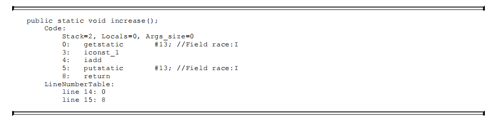
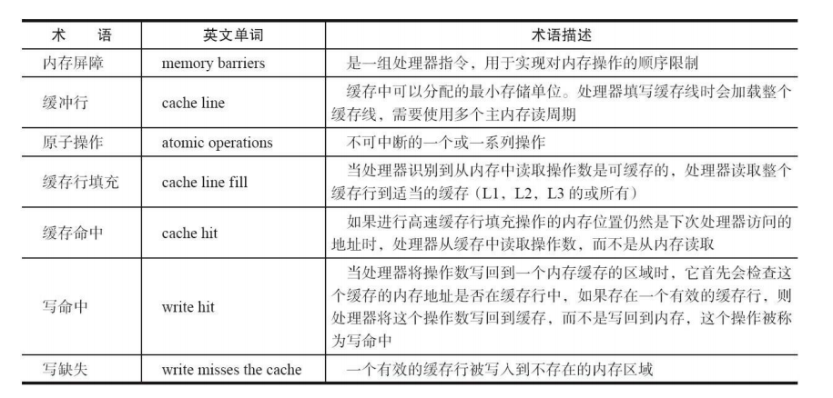
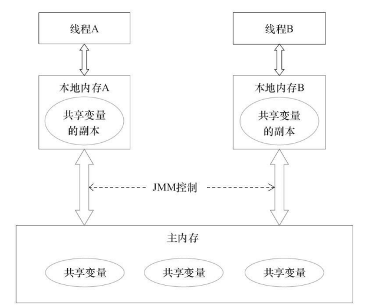
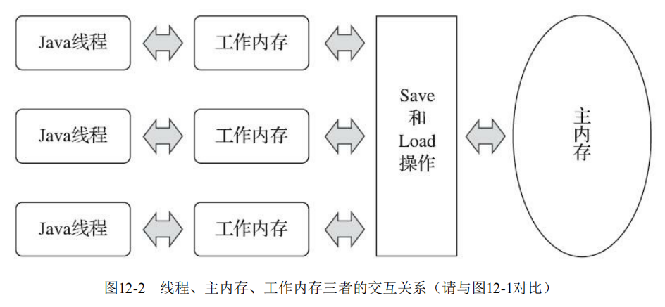

## 并发的底层实现

Java 的代码最终是由 Jvm 解释执行的，因此对=Java 的并发机制而言都是依赖与 Jvm 的实现以及 CPU 的元语指令集。首先我们先看一下一个 Java 程序代码从诞生到运行的整个流程。

~~~shell
Java源码 → 字节码 → 解释器/JIT → 汇编码 → 机器码 → CPU执行
                   ↑
               运行时优化
~~~

我们知道的是对于计算机，无论是 C 、Python、TS 都是无法被计算机直接识别执行的，因为对于计算机而言底层唯一能识别由 CPU 执行的只有机器码也就由 0 与 1 组成的二进制编码，那为什么 Java 的一些并发执行都最终都会调用本地的 Native 方法，而不直接使用 Java 去控制 CPU 的并发呢 ？首先这个主要是由于 JVM 的底层实现机制有关。

首先，对于并发就涉及到了对 CPU 调度的控制，而关于 CPU 的线程的调度，锁机制，以及内存屏障和原子性操作都是需要 CPU 的原语支持，这些控制都必须要求直接方法操作系统以及硬件层，需要进行用户态和内核态之间的相互切换，而内核之间的切换只能调用 C/C++ 层面的操作系统函数

另一方，由于 JVM 为了在某一些方面的特性(跨平台、安全沙箱、垃圾自动回收)做出的牺牲和让步，JVM 屏蔽了对底层系统的直接访问

还有就是 HotSpot JVM 的底层都是使用 C++ 实现的，所有有关操作系统的交互底层机制 (如 `pthread`、Windows thread API) 就需要用 C++ 交互

### volatile 实现与原理

 关键字  volatile  可以说是 Java 虚拟机提供的一个最轻量级的同步机制了，但是可能我们在平时当中其使用的是特别少，或者说刻意的去避免对它的使用。一旦出现多线程竞争数据的问题的时候，一般直接都是使用 synchronized 来完成同步。

volatile  有两个关键的特性：

1. 保证所有的线程之间都吃可见的，比如一个线程修改 volatile  修改的变量之后，另一个线程是可以立即拿到该最新值的，因为我们知道由于 JVM 的内存机制，线程之间的工作私有空间是双方之间不可见的，但 volatile 很好的解决了这一点。
2. 另一方面 volatile  被修饰的变量在被引用的地方都添加了 CPU 原语级别的 lock 指令，也就相当于一个内存屏障，保证重排序时不能把后面的指令重排序到内存屏障之前的位置

虽然说，由于 volatile 修饰的变量在程序运行的过程当中，对于每一个线程而言，自己的私有工作空间的值都是最新的，也就说所有的线程内部该变量的值都是一致的，但是却不能证明 volatile 修饰的变量运算在并发下是线程安全的。虽然说volatile变量在各个线程的工作内存中是不存在一致性问题的（从物理存储的角度看，各个线程的工作内存中volatile变量也可以存在不一致的情况，但由于每次使用之前都要先刷新，执行引擎看不到不一致的情况，因此可以认为不存在一致性问题），但是对于 Java 里面的一些运算操作却并非是原子性的操作，这就会间接的导致  volatile 修饰的变量在并发情况下的运算出现不安全的情况。

 

上面这是一个关于 `race++` 的反编译字节码程序，可以看到的是 `race++` 从语义上看是一条指令，但在编译之后准备执行的字节码层面，其实是有三条指令构成的，分别是 getstatic 指令将值取到操作的栈顶，volatile关键字保证了race的值此时是一个最新的、正确的值。但是在执行 iconst_1、iadd 的时候，此时可能其他的线程以及将 race 的值已经修改了，其实操作栈顶的数据已经算是一个过期的旧数据了，那么当  iconst_1、iadd  在执行完之后，putstatic指令再去同步到主内存，其实就已经不是我们所期待的值了。

***因此可以看到的一个重点就是，getstatic 指令获取值的时候是，完全可以保证这个值是一个最新的值，也就是其他线程写入的值，但是期间如果对这个值有一些改写的操作，就既有可能会导致不一致的问题***

#### 线程之间的可见性

在了解 volatile 之前，我先看看 volatile 的基本用法，从用法开始我们再去研究其底层的具体实现。

~~~ java
public class VolatileVisibilityDemo {

    // 共享变量，测试时不加 volatile 和加 volatile 的区别
    private static volatile boolean running = true;

    public static void main(String[] args) throws InterruptedException {
        // 线程1：读取 running 变量
        Thread readerThread = new Thread(() -> {
            while (running) { // 如果 running 不是 volatile，可能看不到主线程的修改！
                // 空循环，模拟任务
            }
            System.out.println("ReaderThread: running 已变为 false，退出循环");
        });

        // 线程2：修改 running 变量
        Thread writerThread = new Thread(() -> {
            try {
                Thread.sleep(1000); // 等待1秒，确保 readerThread 已经启动
            } catch (InterruptedException e) {
                e.printStackTrace();
            }
            running = false; // 修改 running
            System.out.println("WriterThread: 已设置 running = false");
        });

        readerThread.start();
        writerThread.start();

        readerThread.join();
        writerThread.join();
    }
}
~~~

~~~ shell
ReaderThread: running 已变为 false，退出循环
WriterThread: 已设置 running = false
~~~

从上面的案例可以看到，当 reader 线程开始执行，由于变量 running 为 true 所有程序一直处于空转的状态，而当 writer 线程开始执行的时候修改了 running 状态为 false ，由于使用了 volatile 所以这个修改对于线程 reader 线程来说是可见的，因此就会停止循环结束 reader  走完剩下流程直到线程任务的结束。

#### 指令重排序

由于编码最终被编译之后最终是形成了机器码，而机器码最终可能会由于。指令重排序（Instruction Reordering）是 **CPU 或 JVM 为了提高程序运行效率**，在 **不影响单线程执行结果** 的前提下，对指令的执行顺序进行优化的行为，这种指令优化本身是为了提升程序执行的效率，但有可能会出现一些我们无法预知的问题。

这里举一个简单的案例

~~~ java
public class Singleton {
    private static /* volatile */ Singleton instance; // 测试时去掉 volatile
    private int value; // 用于检查对象是否初始化
    private Singleton() {
        // 模拟初始化耗时操作，增加重排序概率
        try {
            Thread.sleep(1000);
        } catch (InterruptedException e) {
            e.printStackTrace();
        }
        this.value = 42; // 正确初始化后 value 应该是 42
    }

    public static Singleton getInstance() {
        if (instance == null) {
            synchronized (Singleton.class) {
                if (instance == null) {
                    instance = new Singleton(); // 可能发生指令重排序
                }
            }
        }
        return instance;
    }
    public int getValue() {
        return value;
    }
}
~~~


~~~ java
// 线程A执行初始化操作
configOptions = new HashMap();      // 1. 分配内存
configText = readConfigFile();      // 2. 读取配置
processConfigOptions();             // 3. 处理配置
initialized = true;                 // 4. 标记初始化完成（可能被重排序提前执行！）
~~~

如果 `initialized` **没有 `volatile` 修饰**，JVM 或 CPU **可能会对指令进行重排序**，比如：此时，`initialized = true` **被提前执行**，但 `configOptions` 和 `configText` 还未初始化完成！

~~~ shell
initialized = true;               // 4. 先执行！（危险！）
configOptions = new HashMap();    // 1. 后执行
configText = readConfigFile();    // 2. 
processConfigOptions();           // 3. 
~~~


#### 能否保证原子性

我们这里再看一个案例，使用 volatile 是否可以控制线程的原子性？

~~~ java
public class VolatileExample {

    private volatile int  balance = 100;

    public void withdraw(int amount) {
        if (balance >= amount) {
            // #1
            try {
                // 模拟业务处理耗时
                Thread.sleep(50);
            } catch (InterruptedException e) {
                e.printStackTrace();
            }
            balance -= amount;
            System.out.println(Thread.currentThread().getName() + " 取款成功，余额: " + balance);
        } else {
            System.out.println(Thread.currentThread().getName() + " 余额不足");
        }

    }
}
~~~

~~~ java
@Test
public void testVolatileExample() throws InterruptedException {
    VolatileExample account = new VolatileExample();
    List<Thread> threads = new ArrayList<>();

    // 创建5个线程同时取款
    for (int i = 0; i < 5; i++) {
        Thread thread = new Thread(() -> account.withdraw(30), "线程" + i);
        thread.start();
        threads.add(thread);
    }

    for (Thread thread : threads) {
        thread.join();
    }
}
~~~

~~~ shell
线程1 取款成功，余额: 40
线程0 取款成功，余额: -50
线程3 取款成功，余额: 10
线程4 取款成功，余额: 40
线程2 取款成功，余额: -20
~~~

可以从运行的结果看到，由于并能保证原子性。当程序执行到 #1 位置的时候，由于并发执行，当每个线程都拿到初始数据之后，在执行  balance -= amount; 的时候，该命令并非是一个原子性的操作，导致每一个线程从内存读取到数据和写入数据的时机可能是同一时刻，导致与预期结果不同。

| **时间** | **线程 A**           | **线程 B**           | **`balance` 的值** |
| :------- | :------------------- | :------------------- | :----------------- |
| t1       | 读取 `balance = 100` | -                    | 100                |
| t2       | -                    | 读取 `balance = 100` | 100                |
| t3       | 计算 `100 - 50 = 50` | -                    | 100                |
| t4       | -                    | 计算 `100 - 50 = 50` | 100                |
| t5       | 写入 `balance = 50`  | -                    | 50                 |
| t6       | -                    | 写入 `balance = 50`  | 50                 |

通过上面的案例，其实可以看到 volatile 的特性就是将本身，线程之间隔离的变量变得修改可见。那么这个原理到底是什么呢？在这个研究这个基础之上，我们可能需要补充一点 Jvm 内存模型方面的知识，以便于我们更好的理解线程隔离以及 volatile 可见性的两种特性。

#### volatile 原理

既然前面研究了那么多关于 volatile 的具体用法，以及可能存在的一些问题和特性，那这些特性到底是怎么实现的呢？为什么用 volatile 修饰的关键字就可以保证其他线程修改的最新值，可以在其他线程也可以通知到呢？这个就必须谈谈 volatile 关键字所修饰下对于 CPU 层面到底做了什么事情了，来保证去读的就是最新数据。首先在理解其原理之前可能需要先了解一些 CPU 的术语以及说明。

 

这里我举一个案例，来从汇报指令集的角度来分析一下 volatile 修饰下所做的一些事。

~~~ java
public class VolatileWriteTest {
    private static volatile int sharedVar = 0;

    public static void main(String[] args) {
        new Thread(() -> {
            for (int i = 0; i < 1_000_000; i++) {
                sharedVar = i; // volatile 写
            }
        }).start();
    }
}
~~~

使用  JIT 工具生成汇编代码，需要下载对应系统的 **`hsdis`**  动态库（如 `hsdis-amd64.so` 或 `hsdis-amd64.dll`）并放入 `JAVA_HOME/jre/lib/amd64/` 的目录下，运行下面的指令来生产汇编指令代码。

~~~ bash
java -XX:+UnlockDiagnosticVMOptions -XX:+PrintAssembly -XX:+LogCompilation VolatileWriteTest
~~~

- `-XX:+PrintAssembly`：输出 JIT 编译后的汇编代码
- `-XX:+LogCompilation`：记录编译日志（可选）

在输出中搜索 `sharedVar` 的写操作，类似：

~~~ asm
;; Java 代码: sharedVar = i;
0x00007f3c6d1d3a20: mov    %eax,0x14(%r10)     ; 普通写（非 volatile）
0x00007f3c6d1d3a24: lock addl $0x0,(%rsp)      ; volatile 写内存屏障（x86 使用 lock 指令）
~~~

**可以发现的会多出一个 lock 的指令**，其实到这里就可以说明问题了，这个 lock 指令其实就完成了两件事情

1. 将当前处理器的缓存行的数据谢辉到系统内存
2. 这个写回到内存的操作会使其他 CPU 里缓存了该内存地址的数据失效

如果了解一点计算机系统原理的应该是知道**存储层级结构**的顺序应该是 磁盘->内存-> L1(一级缓存)->L2(二级缓存)->寄存器

从 **低速大容量** 到 **高速小容量** 的典型存储层级：

| **层级**       | **访问速度** | **容量** | **管理方**       | **备注**                          |
| :------------- | :----------- | :------- | :--------------- | :-------------------------------- |
| **磁盘/SSD**   | 毫秒级 (ms)  | TB~PB    | 操作系统         | 持久化存储，I/O 瓶颈              |
| **内存 (RAM)** | 纳秒级 (ns)  | GB~TB    | 操作系统/JVM     | 程序运行时数据存放地              |
| **L3 缓存**    | ~10ns        | MB~GB    | CPU              | 多核共享                          |
| **L2 缓存**    | ~5ns         | KB~MB    | CPU（单核独占）  | 比 L1 慢但容量更大                |
| **L1 缓存**    | ~1ns         | KB       | CPU（单核独占）  | 分指令缓存 (L1i) 和数据缓存 (L1d) |
| **寄存器**     | <1ns         | Bytes    | CPU 核心直接管理 | 最快的存储，但数量极少            |

其实计算机为了提高处理的速度，是不直接于内存进行数据通信的，都是由于操作系统将内存的数据读到内部缓存当中,在进行操作的，但是这期间对于操作系统而言，它并不知道将内存当中的数据读到缓存行当中的具体时机。

首先在处理器内部有协议叫做，缓存一致性协议，该协议的主要任务就是，每个处理器通过嗅探总线上的传播数据来检查自己的缓存值是否过期，当处理器发现自己的缓存行对应的内存地址被修改，就会将当前的处理器的缓存行设置为无效状态，当处理器需要修改的时候又重新将该数据读到处理其缓存当中。

所以说到这里，简单总结一下。对于所有的线程当中的工作区域的数据，都是存储在 CPU缓存+寄存器+编译器忧患临时存储 的抽象，线程操作变量是将数据从主内存也就是 RAM ，当中读取到工作区，然后将修改的数据再写入到主内存。而当使用 volatile 关键字修饰的变量，会在 CPU 指令当中添加一个 lock 的关键字，这会让CPU在执行内存操作期间发出 LOCK# 信号，锁定当前的缓存行，其他 CPU 不能修改和读取该变量，直到当前的 CPU 操作完成，而如果在这个期间有其他的CPU的变量副本当中有该缓存行，则该行就会直接失效，重新获取最新的数据。

| 时间点             | CPU1 状态（x）           | CPU2 状态（x）   | 操作说明                             |
| ------------------ | ------------------------ | ---------------- | ------------------------------------ |
| 初始               | Shared                   | Shared           | 两个 CPU 均可读                      |
| 修改前             | Shared → Invalidate 请求 | Shared → Invalid | CPU1 发出 LOCK，CPU2 收到 Invalidate |
| 修改中             | Modified                 | Invalid          | CPU1 独占修改                        |
| 之后 CPU2 想访问 x | Modified → Shared        | Invalid → Shared | CPU1 共享 x，CPU2 获取最新值         |

由于在修改期间，其他 CPU 无法访问该缓存行，修改之后又会回写或共享传播到其他的 CPU ，而整个的 lock 过程本身是一个原子性不可中断的过程，而缓存行的效率要比总线更高。这样就保证了在执行期间的互斥性、可见性、原子性以及高效性。

### 加餐一点并发模型




在 Java 的内存模型当中，每一个线程都有一个独立的私有空间，该空间当中保存了当前线程使用的变量主内存副本，线程的所有关于变量的操作(读取、赋值)都必须在工作内存里面进行处理，而不能之间方法主内存，而由于线程的工作空间是私有的，这也决定了不同的线程之间是无法相互访问彼此的变量的。线程之间的变量传递均是需要通过主内存来完成的

 

 

正是因为对于线程的并发来说，唯一的问题点就是在于如何保证每一个线程自己的工作空间当中，变量都是最新的数据，但这个在不控制并发机制的情况下，几乎是不可能实现的，因为即便是在同一时刻并发执行，每一个线程从主内存当中读到数据之后，都是在自己的工作空间进行数据的操作，而有由于 CPU 时间片的分配问题，则有的线程可能会执行的快将数据刷入到了内存当中，而其他的线程使用的还是旧值在操作，最终其他线程的操作基于旧值，导致写回内存时这个数据就不是我们所期待的数据，这也就是并发编程当中的一个需要解决的重要问题。

### 

### 附录

#### CPU 级别的 LOCK 与  synchronized 的区别

这是一个非常好的问题，涉及**硬件级别的锁（如 `LOCK` 指令）\**与\**语言层面的锁（如 Java 的 `synchronized`）\**之间的本质区别。下面我将从\**原理、层级、开销、控制范围**等方面对比说明。

####  一句话总结

| 锁类型         | 位置         | 粒度                     | 使用方式     | 控制目标           | 实现机制                                  |
| -------------- | ------------ | ------------------------ | ------------ | ------------------ | ----------------------------------------- |
| `LOCK` 指令    | 硬件层 / CPU | 非常细（如一条汇编指令） | 汇编级别指令 | 内存中某变量或地址 | 缓存锁 + 总线控制                         |
| `synchronized` | 语言层 / JVM | 对象或代码块             | Java 编码    | 整个临界区逻辑     | JVM Monitor、进入/退出锁、可能使用 `LOCK` |

####  区别详解

1. **抽象层级不同**

| 项目     | `LOCK` 指令            | `synchronized`   |
| -------- | ---------------------- | ---------------- |
| 所在层级 | CPU 硬件层面           | Java 虚拟机层面  |
| 面向对象 | 否                     | 是               |
| 操作粒度 | 字节或地址（如 `x++`） | 整个代码块或方法 |

- `LOCK` 是汇编层的，控制的是某条具体指令对内存的原子访问；
- `synchronized` 是 JVM 中的语言机制，它可能通过 `LOCK` 实现部分原子性。

2. **作用范围不同**

| 项目         | `LOCK` 指令              | `synchronized`               |
| ------------ | ------------------------ | ---------------------------- |
| 作用目标     | 内存地址、变量           | Java 对象或类实例            |
| 能力         | 保证一条指令的原子性     | 保证多条语句逻辑块的互斥执行 |
| 是否自动解锁 | 自动（执行完指令即释放） | 是（方法/块执行完自动释放）  |

3. **性能与开销**

| 项目     | `LOCK` 指令                      | `synchronized`                   |
| -------- | -------------------------------- | -------------------------------- |
| 粒度     | 更细                             | 更粗                             |
| 性能影响 | 低（但频繁使用可能增加总线压力） | 中等（依赖 JVM 优化）            |
| CPU 影响 | 可能引起缓存失效、内存屏障       | 可被 JVM 优化为偏向锁/轻量级锁等 |

4. **是否阻塞线程**

| 项目           | `LOCK` 指令        | `synchronized`           |
| -------------- | ------------------ | ------------------------ |
| 会阻塞线程吗？ | 不会（是原子操作） | 可能会（线程阻塞等待锁） |
| 可重入性       | 无                 | 有（同一个线程可重入）   |

####  举例对比

✅ `LOCK` 使用场景

```asm
lock inc [x]
```

这表示：对内存地址 `x` 的值执行原子递增，即使多个 CPU 同时执行此指令，也不会发生数据竞争。

✅ `synchronized` 使用场景

```java
synchronized(lockObject) {
    x++;
    y--;
}
```

这里是对一段**临界区逻辑**加锁，而不仅仅是一个变量的增减，涉及线程挂起、等待、唤醒等机制。

####  总结

| 对比项       | `LOCK` 指令                    | `synchronized` 关键字        |
| ------------ | ------------------------------ | ---------------------------- |
| 所在层       | 硬件/汇编                      | Java/JVM 层                  |
| 控制粒度     | 指令级原子性                   | 代码块/对象的互斥            |
| 是否阻塞线程 | 否                             | 是                           |
| 使用方式     | 汇编/CPU 内部实现              | Java 编程使用                |
| 实现目的     | 实现指令原子性，保证并发一致性 | 控制线程同步、保证逻辑正确性 |

------

如果想了解 `synchronized` 底层是如何利用 `LOCK` 的，JVM 在实现 `synchronized` 的时候在关键路径上（如进入对象 monitor）**可能使用带 `LOCK` 前缀的汇编指令**（比如 `lock cmpxchg`）来实现 monitor 的原子获取。

