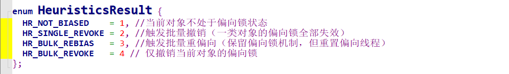

## Synchronized的底层原理

对 Synchronized 而言，其本身的锁与 Java 语言层面的 AQS，CAS 锁存在一定的差异，Synchronized 的锁机制是由 JVM 实现的，JVM 通过 **Monitor** 对象来实现对于方法以及代码块的同步，所以要研究 Synchronized 的底层实现原理，就需要去研究一下虚拟机内部是如何实现这套锁机制的，这里我们就是用 JDK 官方默认的一套 JVM 实现 HotSpot 作为其研究的对象，当然 JVM 的实现不只是只有这一种（比如有 **OpenJ9**、**GraalVM**），这里使用这一种只是因为 HotSpot 是官方默认并且使用率最高的一套实现。

在研究 HotSpot 关于 syncharonized 的具体实现之前，这里需要抛出一个疑问，有没有好奇，既然对于任何的锁来说，都是需要获取到锁资源，比如对于 AQS 与 CAS 我们有lock锁对象，通过 .lock 与 .unlock 就可完成对锁资源的获取与释放。那对于 synchronized 这种特殊的未声明任何的锁对象语法格式，其锁对象是在哪里呢？对于 synchronized  而言其锁对象是本身是一个监视器对象，也就是上面提到过的 **Monitor** 对象当然也有其将它称为 **Monitor（管程）** 。有意思的我们好像并能显式地看到这个对象，其实这就是接下来要引入的概念- **对象头** 。

### 对象头是从何而言，到何而去？

我们知道，对于一个对象创建之后无论你是使用何种方法，比如 new 、序列化、反射。这些创建的对象都是最终在绝大都数情况下都是被存储在了 JVM 内存空间当中的堆空间中，当然这个不包含已经发生内存逃逸的对象。

虽然堆已经是 JVM 内部的一块内存空间，但是为了更好的管理同意，堆的空间内存存储空间又被划分成了 对象头(Header)、实例数据(InstanceData)和对其填充(Padding),这三部分。

而这第一部分就是本篇关于 syncharonized 的重点，也就是存储 Montior 监视器对象的位置-对象头。这部分存储了对象在运行过程当中的自身运行是数据、比如哈希码、CG分代年龄、锁状态标志、线程持有的锁、偏向锁ID、偏向时间戳等。其头的大小是和虚拟机的架构位(这个架构位数大多数是源于 CPU 的寻址能力，就是一次可以处理数据的最大宽度)数有关，比如 32位与64位分别对应的就是 32 比特和 64比特，当然官方对于对象头有用另一种常用的叫法，就做 **Mark Word** 。

关于 **Mark Word ** 头信息当中存储的数据标志位可以参考下面这张表 																							

 

 

### 锁的升级以及对比

在 1.6 版本之前是没有锁升级这种概念的，在次之前一直都是以重量级锁作为 syncharoniozed 的锁机制的，后面是为了性能的优化和提升才引入了“偏向锁”以及“轻量锁” 这种概念和机制。随后锁便有了四种状态 **无锁状态、偏向锁状态、轻量级锁、重量级锁**，在这个过程当中锁除了偏向锁可以降级到无锁状态，其他的只能只升不降，其本身是为了提高获取锁和释放锁的效率。而触发降级的条件是当偏向锁的持有线程不再活跃（如线程终止），或发生竞争时，JVM 会撤销偏向锁，退回到 **无锁状态**。

| 二进制值（低3位） | 锁状态           | 升级方向                                       | 是否支持降级                   |
| ----------------- | :--------------- | :--------------------------------------------- | :----------------------------- |
| `001`             | **无锁**         | → 偏向锁 / 轻量级锁                            | -                              |
| `101`             | 锁状态**偏向锁** | 描述→ 轻量级锁                                 | **可以降级到无锁**（撤销偏向） |
| `000`             | **轻量级锁**     | 对象未被锁定，存储哈希码或分代年龄。→ 重量级锁 | **极少降级**（依赖 JVM 优化）  |
| `010`             | **重量级锁**     | 无进一步升级                                   | **不支持降级**                 |

 

 

从上面的 HotSpot 下 `biasedLocking.cpp` 文件当中 revoke_bias 方法下就可以看到具体的锁降级流程。

#### 偏向锁

在 HotSpot 的作者研究发现，在绝大都数的情况下，锁不仅仅存在多线程的竞争关系，而且还存在总是有一个线程多次重复的获取，